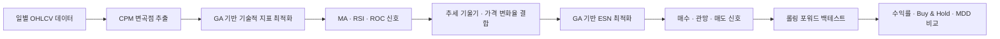
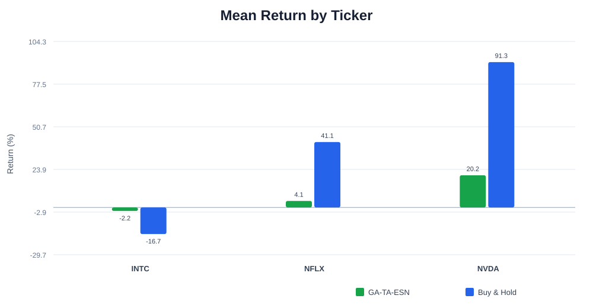
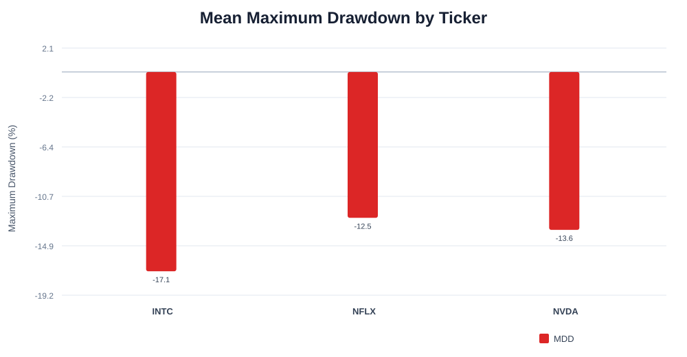

# GA-TA-ESN 주식 매매 신호 예측 모델

> CPM으로 주가의 주요 변곡점을 추출하고, 유전 알고리즘으로 최적화한 기술적 지표를 Echo State Network에 결합한 캡스톤 프로젝트입니다.

[원본 팀 저장소](https://github.com/PKNU-Capstone-Design/GA-TA-ESN-Model) · [실험 설계](docs/EXPERIMENT.md)

## 프로젝트 소개

금융 시계열은 노이즈가 많고 시장 국면에 따라 특성이 계속 달라집니다. 이 프로젝트는 고정된 기술적 지표 설정으로 가격 자체를 예측하는 대신, 다음 과정을 통해 매수·관망·매도 신호를 생성합니다.



모델은 단순 수익률 극대화보다 수익률과 최대 낙폭(Maximum Drawdown)을 함께 고려합니다. 따라서 강한 상승장에서는 Buy & Hold보다 낮은 수익을 기록할 수 있지만, 하락 및 고변동 구간의 손실을 줄이는 방어적 전략을 목표로 합니다.

## 핵심 구현

- CPM(Critical Point Method)을 이용한 주요 추세 전환점 레이블 생성
- GA를 이용한 MA, RSI, ROC 파라미터 탐색
- 장·단기 가격 기울기와 전일 대비 가격 변화율을 포함한 입력 특성 구성
- ESN의 Spectral Radius, Sparsity, Input Scaling 및 매매 임계값 최적화
- Train/Validation/Test를 분리한 Expanding Window 롤링 포워드 검증
- 거래 수수료를 반영한 매매 전략과 Buy & Hold 비교
- 재현용 전체 실험과 환경 확인용 빠른 실행 설정 분리
- 폴드별 인터랙티브 백테스트 HTML 저장

## 기술 스택

| 구분 | 기술 |
|---|---|
| 언어 | Python |
| 데이터 | pandas, NumPy, yfinance |
| 기술적 분석 | TA-Lib |
| 최적화 | DEAP Genetic Algorithm |
| 모델링 | Echo State Network, scikit-learn |
| 검증 | Backtesting.py, Expanding Window |
| 테스트 | unittest |

## 실행 방법

### 1. 가상환경 생성 및 패키지 설치

```bash
python -m venv .venv
```

Windows PowerShell:

```powershell
.\.venv\Scripts\Activate.ps1
pip install -r requirements.txt
```

`TA-Lib` 설치는 운영체제와 Python 버전에 따라 별도 시스템 라이브러리가 필요할 수 있습니다.

### 2. 빠른 실행 확인

```powershell
python example.py --quick --ticker JNJ
```

빠른 실행은 파이프라인의 정상 동작을 확인하기 위한 설정입니다. 여기서 얻은 수치는 최종 성능으로 사용하지 않습니다.

### 3. 전체 실험

```powershell
python example.py `
  --ticker NVDA `
  --start 2015-07-22 `
  --end 2025-07-22
```

기본 전체 실험 설정은 다음과 같습니다.

| 항목 | 값 |
|---|---:|
| Rolling Forward Fold | 5 |
| 초기 학습 비율 | 0.5 |
| ESN GA Population | 30 |
| ESN GA Generation | 30 |
| TA GA Population | 50 |
| TA GA Generation | 50 |
| Random State | 42 |

전체 실험은 CPU 환경에 따라 오래 걸릴 수 있습니다. 각 폴드의 그래프는 `test_df_backtest_results_fold_N.html` 형식으로 저장됩니다.

## 검증 방식

각 폴드에서는 시간 순서를 유지하며 다음 단계를 수행합니다.

1. Train 데이터에서 CPM 레이블과 기술적 지표 파라미터를 구성합니다.
2. Validation 데이터로 ESN 하이퍼파라미터를 선택합니다.
3. Test 데이터는 최종 성능 평가에만 사용합니다.
4. 다음 폴드에서는 학습 구간을 확장하고 같은 과정을 반복합니다.

세부 설정과 결과 정리 기준은 [실험 설계 문서](docs/EXPERIMENT.md)에 기록합니다.

## 실험 결과

2015년 7월부터 2025년 7월까지의 데이터를 사용해 NVDA, INTC, NFLX 세 종목을 각각 5개 폴드로 평가했습니다.

| 종목 | 모델 평균 수익률 | Buy & Hold 평균 | 평균 초과 수익률 | 모델 평균 MDD | B&H 초과 폴드 |
|---|---:|---:|---:|---:|---:|
| INTC | -2.20% | -16.72% | **+14.52%p** | -17.14% | 4 / 5 |
| NFLX | +4.09% | +41.10% | -37.01%p | -12.54% | 1 / 5 |
| NVDA | +20.21% | +91.32% | -71.10%p | -13.58% | 1 / 5 |





### 결과 해석

- INTC에서는 5개 폴드 중 4개에서 Buy & Hold를 앞섰으며 평균 손실을 `14.52%p` 줄였습니다.
- NFLX 하락 폴드에서는 모델 `-17.39%`, Buy & Hold `-64.47%`로 `47.08%p`의 초과 성과를 기록했습니다.
- NVDA 하락 폴드에서는 모델 `+16.10%`, Buy & Hold `-16.07%`로 손실 구간을 양의 수익으로 전환했습니다.
- NVDA와 NFLX의 강한 상승 구간에서는 보수적인 매매 임계값 때문에 Buy & Hold보다 낮은 성과를 기록했습니다.
- NFLX 5번 폴드와 NVDA 4번 폴드에서는 거래 신호가 체결로 이어지지 않아 수익률과 MDD가 0%였습니다. 이는 모델의 방어성과 동시에 지나치게 보수적인 임계값이라는 한계를 보여줍니다.

따라서 이 실험은 모든 시장에서 Buy & Hold를 능가한다는 결론보다, **하락 구간의 손실 방어 가능성과 상승 구간의 기회비용을 함께 확인한 결과**로 해석합니다.

전체 15개 폴드 수치는 [`results/fold_metrics.csv`](results/fold_metrics.csv), 종목별 요약은 [`results/summary.json`](results/summary.json)에서 확인할 수 있습니다.

## 프로젝트 구조

```text
GA-TA-ESN-Model/
├─ CPM.py                  # 주요 변곡점 추출
├─ MovingAverage.py        # MA 신호 및 GA 최적화
├─ RSI.py                  # RSI 신호 및 GA 최적화
├─ ROC.py                  # ROC 신호 및 GA 최적화
├─ ESN_Signals.py          # ESN 학습과 매매 신호 생성
├─ pyESN.py                # ESN 구현
├─ CV_ESN.py               # 롤링 포워드 검증과 백테스트
├─ eval_signal.py          # 신호 기반 전략 평가
├─ example.py              # 실행 진입점
├─ docs/                   # 실험 및 공개 문서
├─ results/                # 검증 완료된 결과
└─ tests/                  # 회귀 테스트
```

## 현재 한계

- 시장 국면을 구분하지 않고 동일한 위험 성향을 적용합니다.
- 강한 상승장에서는 방어적인 신호 때문에 Buy & Hold보다 낮은 성과가 날 수 있습니다.
- GA 탐색 결과는 탐색 크기와 난수 조건에 영향을 받습니다.
- 거래세, 슬리피지, 유동성 및 시장 충격을 완전하게 반영하지 않습니다.
- 과거 데이터의 백테스트 결과는 미래 성과를 보장하지 않습니다.

향후에는 시장 국면별 적응형 적합도 함수, 동적 CPM 임계값, 트레일링 스톱 및 다종목 포트폴리오 평가를 검토할 수 있습니다.

## 참고 연구

- D. Bao, “A generalized model for financial time series representation and prediction,” *Applied Intelligence*, 29, 1-11, 2008.
- X. Lin, Z. Yang and Y. Song, “Intelligent stock trading system based on improved technical analysis and Echo State Network,” *Expert Systems with Applications*, 38, 11347-11354, 2011. [DOI](https://doi.org/10.1016/j.eswa.2011.03.001)
- T. Chen and C. Guestrin, “XGBoost: A Scalable Tree Boosting System,” *KDD*, 2016. [DOI](https://doi.org/10.1145/2939672.2939785)

## 안내

이 저장소는 연구와 교육을 목적으로 제작되었습니다. 제공되는 모델과 백테스트 결과는 투자 권유가 아니며 실제 투자 성과를 보장하지 않습니다.
